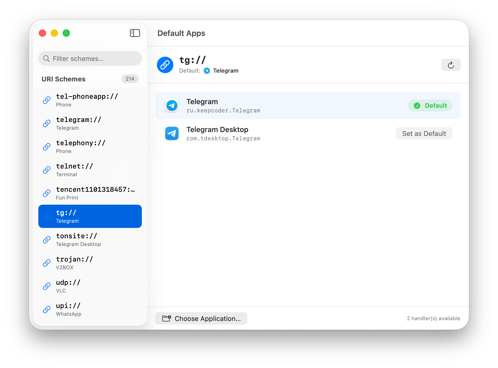

# DefaultApps

This app allows to choose the default handler for URI schemes in macOS (e.(e.g. `http:`, `mailto:`, `tg`, `ssh`, etc.):



Vibe-coded.

## Build

To build an .app bundle:

```bash
./build_app.sh
```
